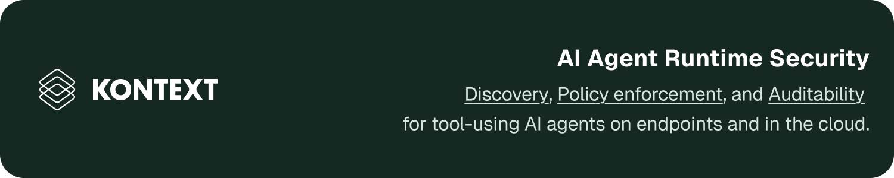

<div align="center">

<p>
  <a href="https://kontext.security">Website</a>
  |
  <a href="https://docs.kontext.security/getting-started/welcome">Documentation</a>
  |
  <a href="https://app.kontext.security">Dashboard</a>
  |
  <a href="https://discord.gg/gw9UpFUhyY">Discord</a>
</p>

<p>
  <a href="LICENSE"></a>
  <a href="https://github.com/kontext-security/kontext-cli/releases"></a>
  
</p>

</div>

Runtime governance for AI agents, with local policy decisions, pre-action
enforcement, and an authorization ledger.

Kontext runs alongside AI agents on developer machines and in cloud
environments. It receives tool-use events through local hooks, evaluates
policy before consequential actions execute, and records decisions and outcomes
in an authorization ledger. The decision path stays local; managed deployments
can export redacted records to the Kontext dashboard.

[The agent support matrix](docs/coverage.md) is authoritative for each agent and event
surface. Blocking is off by default and available only at supported synchronous
pre-action hooks.

## Quickstart

```bash
brew install kontext-security/tap/kontext
kontext setup
```

Create an install token in the Kontext dashboard when setup asks for one.
Setup stores the token in the login keychain, installs hooks for supported
agents, and starts a background daemon.

```bash
kontext doctor
```

Use `doctor` to check self-serve hook status, daemon health, and the managed
export backlog. It exits non-zero when a configured installation is unhealthy.
For a self-serve stale daemon, `kontext doctor --fix` performs the verified
restart; other findings include their manual remediation. Re-run `kontext
setup` to rotate the token. Run `kontext setup --uninstall` to remove the
self-serve installation. Self-serve setup currently supports macOS.

## How it works

```text
agent asks to use a tool
        |
        v
Kontext receives the action through a hook
        |
        v
local policy allows, denies, or records a would-decision
        |
        v
the decision is written to the local authorization ledger
```

The decision path is local. A managed deployment adds configuration and record
export; it does not require a hosted service to answer every tool call.

## Core features

Kontext balances security and utility for AI agents: low-risk actions keep moving, and unsafe actions can be blocked before they execute.

- **Observe agent actions.** Record supported tool calls, policy decisions, and
  outcomes in a local authorization ledger.
- **Apply policy before actions run.** Use deterministic rules for boundaries
  such as destructive commands, sensitive files, production systems, data
  exports, and credential access.
- **Roll out safely.** Observe mode shows what policy would deny without
  interrupting work. Enforce mode returns a real denial for matching rules.
- **Keep evidence.** Store redacted records locally and, for managed
  deployments, send them to the Kontext dashboard for review.
- **Run where the agent runs.** Use Kontext on a developer machine, in a cloud
  sandbox, or in another managed agent environment with a supported hook.

## Managed deployments

For enterprise identity, audit retention, organization controls, deployment planning, custom usage volume, and onboarding for security and platform teams, contact [michel@kontext.security](mailto:michel@kontext.security) or [book here](https://calendar.superhuman.com/book/11W5Y8b5JsB8dOzQbd/YECs9).

## Agent support matrix

[See the agent support matrix](docs/coverage.md) for the exact events, enforcement
points, installation scope, and known gaps for each agent. It is the source of
truth for what “supported” means; an integration is not treated as fully
covered merely because Kontext can receive an event from it.

## Data handling

Kontext stores tool activity and decision evidence, not model reasoning or full
conversation history. Sensitive values are redacted before local storage and
managed export.

## Development

```bash
go build -o bin/kontext ./cmd/kontext
go test ./...
go test -race ./...
go vet ./...
```

## Community

- Read [SUPPORT.md](SUPPORT.md) for support channels.
- Read [CONTRIBUTING.md](CONTRIBUTING.md) before opening a contribution.
- Kontext CLI is released under the [MIT License](LICENSE).
